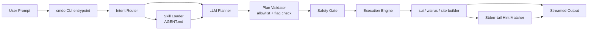

# Architecture

Commando is a thin orchestration layer between human intent and three upstream Mysten Labs CLIs. Everything runs locally; nothing in the request path requires a Commando-owned server.

## Component diagram

## 1. Installer & Bootstrap

Triggered by npm `postinstall` (also runnable as `cmdo bootstrap`). Lives in `src/bootstrap/`.

- **`platform.ts`** — detects host OS (`windows` / `linux` / `macos`) and arch (`x86_64` / `aarch64` / `arm64`); throws on unsupported triples with a clear message.
- **`download-gh.ts`** — direct GitHub release downloads; system `tar` extraction; chmod +x on Unix.
- **`download.ts` + `r2Client.ts`** — opt-in R2 manifest path (Windows only, gated by `CMDO_MANIFEST_URL` + `CMDO_R2_TOKEN`); adds SHA256 provenance per binary.
- **`addToPath.ts`** — Windows registry edit; appends to `~/.bashrc` / `~/.zshrc` / `~/.bash_profile` / `~/.profile` on Unix with an idempotence marker.
- **`configs.ts`** — auto-bootstraps `~/.sui/sui_config/client.yaml` (non-interactive `sui client active-address` piped with `y\n\n0\n`) and fetches `~/.config/walrus/client_config.yaml` from the Mysten docs (testnet default).

## 2. Skill Generator

`src/skills/generator.ts` shells out to each binary with `--help` (and one level of subcommand `--help`), parses the output into normalized markdown sections, and writes `~/.commando/skills/AGENT.md`. The generator is platform-aware — it resolves `sui` vs `sui.exe` via `toolFilename(base)` so the same logic works on Windows and Unix.

`AGENT.md` is the **single source of truth** for the LLM planner. Re-run `cmdo update-skills` after upgrading any binary.

## 3. Intent Router

`src/router/`. Two strategies, in order:

1. **Hard override** — `--sui`, `--walrus`, or `--site-builder` flag wins immediately.
2. **Keyword inference** — score-based matching against tool-specific verbs and nouns (e.g. "publish", "move", "address" → sui; "blob", "wal" → walrus; "deploy", "site", "epochs" → site-builder).

The router also performs **scope reduction**: only the relevant section of `AGENT.md` is sent to the LLM, keeping the prompt small and reducing the hallucination surface.

## 4. LLM Planner

`src/llm/planner.ts`. Calls OpenAI or OpenRouter with a hard-rules system prompt:

- Output **must** be a single JSON object `{ binary, args }`.
- The `binary` value is normalized against an allowlist (`sui` / `walrus` / `site-builder`, with the platform-correct `.exe` suffix on Windows).
- Positional arguments (directories, object IDs, hashes) are emitted as bare strings — never as flags.
- Verbs are disambiguated explicitly (`build` ≠ `test` ≠ `publish`; `deploy <DIRECTORY>` requires the directory).

### Defensive parsing

`tryParseJson` extracts the first balanced JSON object from the raw LLM output, even when the model wraps it in prose, markdown fences, or smart quotes. If the model returns nothing usable after the configured retries, the call fails with a clear "LLM did not return valid JSON" error.

### Plan validation

`validatePlan(plan, ctx)` checks:

1. `binary` is in the allowlist.
2. The leading non-flag tokens of `args` form a command path that exists in `ctx.allowedCommands` (built from `AGENT.md`).
3. Every flag in `args` exists in the skill contract for that command path.

A failed check triggers a retry with a tighter hint instead of forwarding a hallucinated command. After the final retry, the call surfaces the validation error.

### Mock mode

`CMDO_LLM_MOCK=1` swaps in a deterministic regex-driven planner that covers the most common Sui / Walrus / Site-builder verbs. Useful for hackathon demos with unreliable network and for unit tests.

## 5. Safety Gate

`src/safety/gate.ts`. Runs **twice**:

- **Pre-LLM** — pattern-matches the raw user prompt against `PROMPT_PATTERNS` (cross-platform destructive intent: `del C:\\`, `rm -rf /`, `format`, `mkfs`, `dd if=`, `shutdown`, `reboot`, ...). Blocks before any tokens are sent to a third party.
- **Post-LLM** — pattern-matches the planned `args` array against `ARG_PATTERNS`. Catches cases where the LLM re-introduces destructive arguments despite a benign-looking prompt.

Plus the structural allowlist: `binary` must resolve to a file inside `~/.commando/bin/`.

## 6. Execution Engine

`src/exec/spawner.ts`. Uses `child_process.spawn` with explicit argument arrays — no shell interpolation, so quoting is never an issue.

- `stdio: ['inherit', 'inherit', 'pipe']` — stdin and stdout pass through directly to the user's terminal; stderr is teed to `process.stderr` (live output) **and** captured into a small ring buffer.
- On non-zero exit, the ring buffer is matched against `FAILURE_HINTS`. Examples:
  - `could not find a valid Walrus configuration file` → "run `cmdo bootstrap` to recreate the client config".
  - `could not find WAL coins with sufficient balance` → "run `cmdo \"get wal\"` (and verify your context is testnet)".
  - `could not find SUI coins with sufficient balance` → "run `cmdo \"give me testnet sui from faucet\"`".

This keeps the user out of "stare at a stack trace" mode.

## Data & state

| Path | Owner | Purpose |
|---|---|---|
| `~/.commando/bin/` | Commando | Downloaded upstream binaries |
| `~/.commando/skills/AGENT.md` | Commando | Generated command/flag contract for the LLM |
| `~/.commando/sandbox/default/` | Commando | Default sandbox profile (configs, keystore, projects) |
| `~/.commando/cache/` | Commando | Temporary downloads, manifests, etc. |
| `~/.sui/sui_config/` | Sui CLI | Wallet, keystore, client config |
| `~/.config/walrus/client_config.yaml` | Walrus CLI | Walrus testnet/mainnet endpoints |
| `~/.config/walrus/sites-config.yaml` | Site-builder | Walrus Sites contexts (manual in 0.2.4-beta) |

No server-side user state in MVP.

## Security posture (v0.2.4-beta)

- **No secrets in the npm tarball.** `src/config/defaults.ts` is treated as semi-public; the previous hardcoded R2 manifest auth key was removed and rotated. Operator credentials (R2 token, LLM API keys) are read from env vars only.
- Local key storage only; no key exfiltration feature.
- Minimal permission model with local file boundaries.
- Pre-LLM safety gate keeps destructive intent out of third-party prompts.
- Post-LLM safety gate + allowlist keeps destructive args off `spawn`.
- Optional command audit log (stretch, off by default).

## Reliability choices

- Direct upstream downloads remove the operator-owned mirror as a single point of failure.
- Single sandbox profile keeps profile-management bugs out of MVP.
- Single-step execution per prompt — no multi-step planning loop.
- Idempotent recovery commands: `cmdo bootstrap` and `cmdo update-skills`.

## Post-MVP

- Multiple sandbox profiles + sharing model.
- Signed command templates and a richer policy engine.
- Provider routing/fallback for LLM calls.
- Optional signed manifest distribution (rebuild the R2 path with rotated keys + per-asset signatures).

## Next

<Cards>
  <Card title="Safety" description="What the safety gate blocks and how to extend the patterns." href="/documentation/guides/safety" icon="Lock" />
  <Card title="LLM Setup" description="Provider choice and model defaults." href="/documentation/guides/llm-setup" icon="Sparkles" />
  <Card title="CLI Reference" description="Every cmdo subcommand and flag." href="/documentation/reference/cli" icon="Terminal" />
</Cards>
