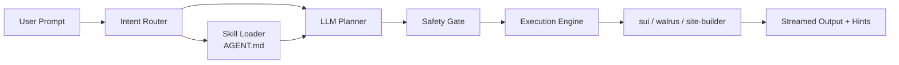

import { Callout } from 'fumadocs-ui/components/callout';


# Commando

> One Command. Zero Config. Grounded Intelligence.

**Commando (`cmdo`)** is a local-first CLI agent that turns plain-English (or Vietnamese!) intent into safe, validated `sui` / `walrus` / `site-builder` commands. It downloads the upstream Mysten Labs binaries for you, bootstraps the wallet and config files you would otherwise hit as paper-cuts on first run, and uses an LLM grounded in **live `--help` output** to plan each command.

<Callout type="info">
  **Current release: `v0.2.4-beta`** — cross-platform (Windows / Linux / macOS), GitHub-direct binary downloads, no secrets shipped in the npm tarball.
</Callout>

## Why Commando

<Cards>
  <Card title="Zero setup" description="One npm install puts sui, walrus, and site-builder on your PATH and bootstraps every config file they need." icon="Rocket" />
  <Card title="Grounded LLM" description="The planner is constrained to commands and flags parsed from each binary's --help output, with strict allowlist validation." icon="ShieldCheck" />
  <Card title="Cross-platform" description="Same one-line install on Windows (PowerShell), Ubuntu, and macOS (Intel + Apple Silicon)." icon="Layers" />
  <Card title="Safe by default" description="A safety gate blocks destructive intent (rm -rf /, format, dd if=, shutdown, ...) before any process is spawned." icon="Lock" />
</Cards>

## 60-second tour

```bash
# 1. Install (any OS, Node 20+)
npm install -g sui-commando@beta

# 2. Configure your LLM provider once
cmdo init

# 3. Talk to the Sui ecosystem
cmdo "create new sui address"
cmdo "give me testnet sui from faucet"
cmdo "build my move package"
cmdo "deploy static site in ./dist to walrus-sites" --site-builder
```

That's the whole loop. No `sui client switch --env testnet`, no manual `walrus get-wal`, no chasing the right `site-builder deploy` flags — Commando plans the command, validates it against the live skill contract, and streams the output back.

## How it works



1. **Router** picks the target binary from explicit flags (`--sui`, `--walrus`, `--site-builder`) or keyword inference.
2. **Skill loader** trims `~/.commando/skills/AGENT.md` (auto-generated from `--help`) to only the relevant tool.
3. **LLM planner** (OpenAI or OpenRouter) emits structured `{ binary, args }`. The output is parsed defensively and the command path is validated against the allowlist; hallucinated subcommands trigger a retry instead of being executed.
4. **Safety gate** rejects destructive patterns on every supported OS.
5. **Execution engine** spawns the real binary, streams stdout/stderr live, and matches the stderr tail against well-known failure patterns to print actionable hints (e.g., "missing WAL coins → try `cmdo \"get wal\"`").

Read the full design in [Architecture](/documentation/guides/architecture).

## What ships in v0.2.4-beta

| Area | Status |
|---|---|
| Windows x86_64 | Stable |
| Linux x86_64 | Stable |
| Linux aarch64 | Stable (site-builder skipped — no upstream build) |
| macOS x86_64 / arm64 | Stable |
| Auto-bootstrap Sui wallet | Yes (`~/.sui/sui_config/client.yaml`) |
| Auto-bootstrap Walrus config | Yes (`~/.config/walrus/client_config.yaml`, testnet default) |
| LLM providers | OpenAI, OpenRouter |
| Mock planner | `CMDO_LLM_MOCK=1` for offline demos |
| Secret-free tarball | Yes — operator credentials read from env vars only |

## Where to go next

<Cards>
  <Card title="Quickstart" description="Install, configure, and run your first prompt in under 5 minutes." href="/documentation/quickstart" icon="Rocket" />
  <Card title="Installation" description="Cross-platform install details, env vars, and the optional R2 mirror." href="/documentation/guides/installation" icon="Download" />
  <Card title="Architecture" description="Components, data flow, and the safety model in depth." href="/documentation/guides/architecture" icon="Layers" />
  <Card title="LLM Setup" description="Pick a provider, set a key, choose a model." href="/documentation/guides/llm-setup" icon="Sparkles" />
  <Card title="Sui Cookbook" description="Copy-paste prompts for wallets, faucet, build, publish." href="/documentation/examples/sui-flows" icon="BookOpen" />
  <Card title="Walrus Sites" description="Deploy a static site to Walrus Sites end-to-end." href="/documentation/examples/walrus-sites" icon="Cloud" />
  <Card title="CLI Reference" description="Every cmdo subcommand and flag." href="/documentation/reference/cli" icon="Terminal" />
  <Card title="Troubleshooting" description="Common errors and the hints Commando prints for them." href="/documentation/guides/troubleshooting" icon="LifeBuoy" />
</Cards>
