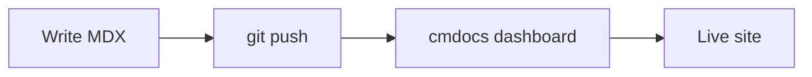

# Components

cmdocs ships with a rich set of components. Use them in any MDX file — no imports required.

## Callout

Highlight important information.

<Callout type="info">
  This is an informational callout. Use it for tips and notes.
</Callout>

<Callout type="warn">
  This is a warning callout. Use it for caveats and gotchas.
</Callout>

<Callout type="error">
  This is an error callout. Use it for destructive actions or critical warnings.
</Callout>

```mdx
<Callout type="info">An info callout.</Callout>
<Callout type="warn">A warning callout.</Callout>
<Callout type="error">An error callout.</Callout>
```

## Cards

Display linked content in a responsive grid.

<Cards>
  <Card title="Quickstart" description="Edit your first page in 2 minutes." href="/documentation/quickstart" icon="Rocket" />
  <Card title="Writing Content" description="MDX basics and frontmatter." href="/documentation/guides/writing-content" icon="PencilLine" />
</Cards>

```mdx
<Cards>
  <Card title="Quickstart" description="Edit your first page." href="/documentation/quickstart" icon="Rocket" />
  <Card title="Writing Content" description="MDX basics." href="/documentation/guides/writing-content" icon="PencilLine" />
</Cards>
```

The `icon` prop accepts any [Lucide icon name](https://lucide.dev/icons).

## Tabs

Switch between content views.

<Tabs items={["npm", "bun", "pnpm"]}>
  <Tab value="npm">
    ```bash
    npm install cmdocs
    ```
  </Tab>
  <Tab value="bun">
    ```bash
    bun add cmdocs
    ```
  </Tab>
  <Tab value="pnpm">
    ```bash
    pnpm add cmdocs
    ```
  </Tab>
</Tabs>

````mdx
<Tabs items={["npm", "bun", "pnpm"]}>
  <Tab value="npm">
    ```bash
    npm install cmdocs
    ```
  </Tab>
  <Tab value="bun">
    ```bash
    bun add cmdocs
    ```
  </Tab>
  <Tab value="pnpm">
    ```bash
    pnpm add cmdocs
    ```
  </Tab>
</Tabs>
````

## Steps

Numbered, sequential instructions.

<Steps>
  <Step>
    **Install** — Run the install command for your package manager.
  </Step>
  <Step>
    **Initialize** — Run `cmdocs init` to scaffold a new project.
  </Step>
  <Step>
    **Write** — Open your MDX files and start documenting.
  </Step>
</Steps>

```mdx
<Steps>
  <Step>**Install** — Run the install command.</Step>
  <Step>**Initialize** — Run `cmdocs init`.</Step>
  <Step>**Write** — Start documenting.</Step>
</Steps>
```

## Accordion

Collapsible sections — great for FAQs.

<Accordions>
  <Accordion title="What is cmdocs?">
    cmdocs is a documentation platform that builds beautiful static sites from MDX.
  </Accordion>
  <Accordion title="Is it free?">
    cmdocs has a generous free tier — get started without a credit card.
  </Accordion>
  <Accordion title="How do I deploy?">
    Push your repo to GitHub and connect it in the [cmdocs dashboard](https://cmdocs.sh). Every commit triggers a build and deploys to `<your-project>.cmdocs.app` automatically.
  </Accordion>
</Accordions>

```mdx
<Accordions>
  <Accordion title="What is cmdocs?">
    cmdocs is a documentation platform.
  </Accordion>
  <Accordion title="Is it free?">
    cmdocs has a generous free tier.
  </Accordion>
</Accordions>
```

## Files

Show file tree structures.

<Files>
  <Folder name="my-docs" defaultOpen>
    <File name="docs.json" />
    <File name="index.mdx" />
    <File name="quickstart.mdx" />
    <Folder name="guides" defaultOpen>
      <File name="writing-content.mdx" />
      <File name="components.mdx" />
    </Folder>
    <Folder name="public" defaultOpen>
      <File name="favicon.svg" />
      <Folder name="logo" defaultOpen>
        <File name="light.svg" />
        <File name="dark.svg" />
      </Folder>
    </Folder>
  </Folder>
</Files>

```mdx
<Files>
  <Folder name="my-docs" defaultOpen>
    <File name="docs.json" />
    <File name="index.mdx" />
    <Folder name="guides" defaultOpen>
      <File name="writing-content.mdx" />
    </Folder>
  </Folder>
</Files>
```

## TypeTable

Document props, configuration options, or API parameters.

<TypeTable
  type={{
    name: { description: "Site name shown in the navbar.", type: "string", required: true },
    description: { description: "Short description for SEO meta tags.", type: "string" },
    theme: { description: "Theme settings — colors, dark mode, layout.", type: "ThemeConfig" },
  }}
/>

```mdx
<TypeTable
  type={{
    name: { description: "Site name.", type: "string", required: true },
    theme: { description: "Theme settings.", type: "ThemeConfig" },
  }}
/>
```

## Mermaid

Render diagrams from [Mermaid](https://mermaid.js.org/) syntax. Great for flow charts, sequence diagrams, and architecture overviews.

<Mermaid chart="graph LR;
    A[Write MDX] --> B[git push];
    B --> C[cmdocs dashboard];
    C --> D[Live site];" />

````mdx

````

Mermaid diagrams adapt to light and dark themes automatically.

## Images

All images are zoomable — click to expand. Use either Markdown or ``:

```mdx


```

Place images in the `public/` folder and reference them with an absolute path starting with `/`.

## Banner

Display a site-wide announcement above the navbar. Use `<Banner>` at the top of any MDX file — the most recent occurrence wins, and it appears on every page:

```mdx title="index.mdx"
<Banner>
  cmdocs v1.0 is out — [read the release notes](/documentation/changelog).
</Banner>
```

Banners support full Markdown, including links and inline code. Common patterns:

```mdx
<Banner>
  🎉 We just shipped v2 — [see what's new](/documentation/changelog).
</Banner>

<Banner>
  ⚠️ Scheduled maintenance tonight, 22:00-23:00 UTC.
</Banner>
```

To remove the banner, delete the `<Banner>` tag from your MDX. To show it only on certain pages, place the tag only in those files.

## Component reference

<TypeTable
  type={{
    Callout: { type: "Component", description: "Highlight info. Props: type ('info' | 'warn' | 'error')." },
    Card: { type: "Component", description: "A linked card. Props: title, description, href, icon." },
    Cards: { type: "Component", description: "Responsive grid for Card components." },
    Tab: { type: "Component", description: "A single tab panel inside Tabs. Props: value." },
    Tabs: { type: "Component", description: "Tabbed content container. Props: items (string[])." },
    Step: { type: "Component", description: "A single step inside Steps." },
    Steps: { type: "Component", description: "Numbered step container." },
    Accordion: { type: "Component", description: "Collapsible section. Props: title." },
    Accordions: { type: "Component", description: "Container for Accordion items." },
    File: { type: "Component", description: "A file in a Files tree. Props: name." },
    Folder: { type: "Component", description: "A folder in a Files tree. Props: name, defaultOpen." },
    Files: { type: "Component", description: "File tree container." },
    TypeTable: { type: "Component", description: "Property/type table. Props: type (object)." },
    Mermaid: { type: "Component", description: "Mermaid diagram. Props: chart (string)." },
    Banner: { type: "Component", description: "Site-wide banner above the navbar." },
  }}
/>
