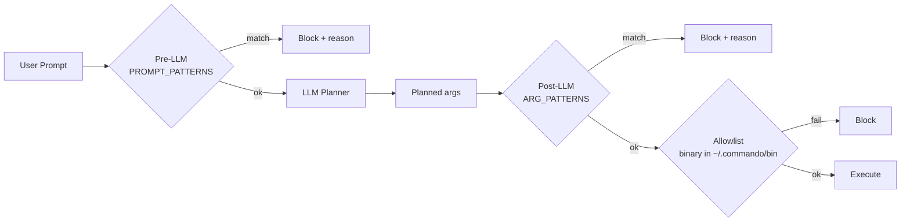

# Safety

Commando assumes the user is a developer, not an adversary — but it also assumes the LLM occasionally produces nonsense. The safety gate runs **twice** to keep both human typos and model hallucinations out of `spawn`.

## The two layers



### Layer 1 — Pre-LLM prompt screen

`PROMPT_PATTERNS` matches the **raw user input** before it reaches a third-party API. Catches things like:

- `delete everything in C drive`, `format C:`, `del C:\\`
- `rm -rf /`, `rm -rf ~`, `rm -rf ~/.ssh`
- `mkfs`, `dd if=/dev/zero`, `:(){ :|:& };:` (fork bomb)
- `shutdown /s`, `shutdown -h now`, `reboot`
- Prompts attempting to exfiltrate keys (`cat ~/.ssh/id_rsa`, `print my private key`)

Blocked prompts never leave your machine.

### Layer 2 — Post-LLM arg screen

`ARG_PATTERNS` matches the LLM-emitted `args` array. Catches the case where a benign-looking prompt is misinterpreted into a destructive command, or where a prompt-injection payload smuggled past Layer 1 emerges as an explicit destructive arg.

Both layers share most patterns but use different anchoring (free text vs. tokenized argv).

### Structural allowlist

Independent of the pattern matchers:

- `binary` must resolve to a real file inside `~/.commando/bin/`.
- The command path (leading non-flag tokens) must be in the allowlist generated from `~/.commando/skills/AGENT.md`.
- Every flag must exist in the skill contract for that command path.

Any failure short-circuits before `spawn`.

## What you'll see when it fires

```text
$ cmdo "delete everything in C drive"
[safety] Prompt blocked by safety policy
[safety] reason: matches PROMPT_PATTERNS rule "destructive intent: delete everything in <drive>"
[safety] hint: Commando does not execute prompts that look like destructive system actions.
         If you really meant to do this, run the underlying command directly.
```

Exit code: `non-zero`. No LLM call is made for Layer 1 blocks; no `spawn` is made for Layer 2 blocks.

## Extending the patterns

The patterns live in `src/safety/gate.ts`:

```ts
// Pseudocode — see the real file for the full list.
export const PROMPT_PATTERNS = [
  { re: /\b(rm|del)\s+-?r?f?\s+(\/|c:\\)/i, reason: 'destructive intent: ...' },
  { re: /\bformat\s+[a-z]:/i,               reason: '...' },
  // ...
];

export const ARG_PATTERNS = [
  { re: /^--?force(-?yes)?$/i,              reason: 'forced destructive flag' },
  // ...
];
```

To add a rule:

1. Add an entry to `PROMPT_PATTERNS` and/or `ARG_PATTERNS` with a clear `reason` (it's surfaced to the user).
2. Add a unit test in `tests/safety/` covering both the positive case (must block) and a negative case (must not over-block).
3. Run `npm test` to make sure existing prompts still plan as before.

## What the gate does **not** do

- It does **not** rate-limit or throttle. If an LLM returns the same wrong plan 100 times, you'll get 100 retries (capped at the validator's max retries).
- It does **not** sandbox the spawned process. `sui` and `walrus` run with your user's full privileges. Use a dedicated user / container if that matters.
- It does **not** scan binary outputs for secrets. Streamed stdout/stderr go to your terminal verbatim.
- It does **not** parse Move source code for malicious constructs. The gate is at the CLI layer, not the application layer.

## Disabling (don't)

There is no kill switch for the safety gate in 0.2.4-beta — the worst case is a noisy false positive that you can route around by running the underlying CLI directly. If you have a legitimate reason for a `cmdo --i-know-what-im-doing` mode, file an issue with your use case.

## Related

<Cards>
  <Card title="Architecture" description="Where the gate sits in the request pipeline." href="/documentation/guides/architecture" icon="Layers" />
  <Card title="Troubleshooting" description="How to tell a safety block from a runtime failure." href="/documentation/guides/troubleshooting" icon="LifeBuoy" />
</Cards>
